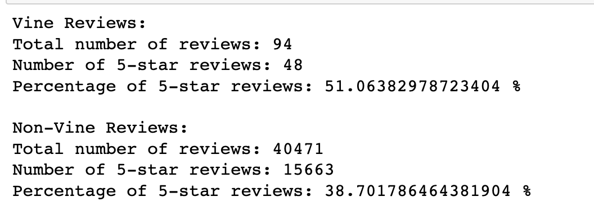

# Amazon Vine Program Analysis

## Overview
  The purpose of this analysis is to examine the reviews of a product and determine if there is a positivity bias in the Vine program. The Vine program is a service provided by Amazon that offers free products to customers in exchange for an honest review. By comparing the percentage of 5-star reviews between the Vine program and non-Vine program, we can evaluate if there is a difference in rating behavior between the two groups. This analysis can provide insights into the effectiveness and fairness of the Vine program, and can help companies and consumers understand the impact of the program on product reviews.

## Results
• How many Vine reviews and non-Vine reviews were there?

Total number of Vine reviews: 94
Total number of non-Vine reviews: 40,471

• How many Vine reviews were 5 stars? How many non-Vine reviews were 5 stars?

Number of 5-star Vine reviews: 48
Number of 5-star non-Vine reviews: 15,663

• What percentage of Vine reviews were 5 stars? What percentage of non-Vine reviews were 5 stars?

Percentage of 5-star Vine reviews: 51.06%
Percentage of 5-star non-Vine reviews: 38.70%

The image below shows a printed statement using results from the dataframes used to gather this information.

## Summary
